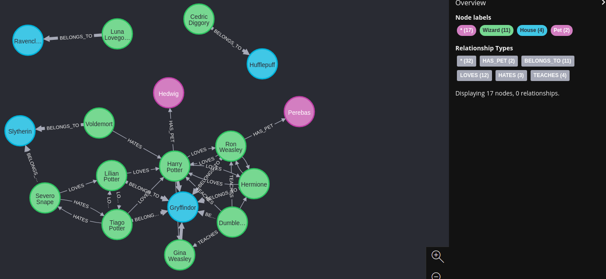
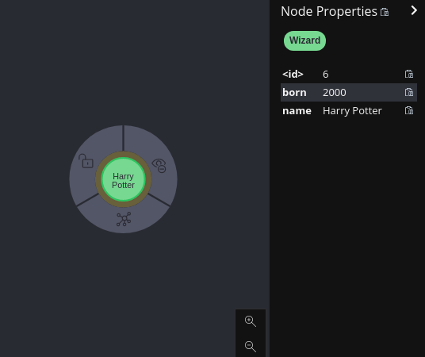
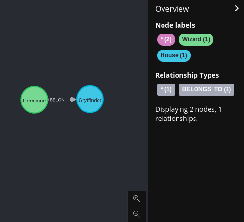
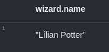

# Neo4j

## Authors

- Mayara Chew Marinho

## What is Neo4j?

Neo4j is a native graph database. Each node contains a data register and it is connected with others nodes by relations. Queries are faster than SQL databases, because the relations are registered in the database and we do not have to do a lot of queries using the index.

https://neo4j.com/developer/get-started/

## Cypher

The language used to query on Neo4j database is Cypher.

https://neo4j.com/developer/cypher/

### Creating a database with Cypher

The file `load-harry-potter-universe.cypher` is a script that create a Harry Potter Universe database.

First, install Neo4j (https://neo4j.com/download/neo4j-desktop/?edition=desktop&flavour=unix&release=1.4.12&offline=true).

Then, run the script on "Neo4j browser".

You just have to run the script once. In case you modify de code and want to run again, run the following code on "Neo4j browser" and run the script again.

`MATCH (n) WHERE (n:Wizard OR n:Pet or n:House) DETACH DELETE n`

### Doing queries with Cypher

1. Return all nodes and relationships of the database:
   `MATCH (n) RETURN n`

    

        
    

2. Find informations about the Wizard "Harry Potter":
   `MATCH (Harry:Wizard {name: 'Harry Potter'}) RETURN Harry`

    

        
    

3. Find the House and the House relation of the Wizard named "Hermione Granger":
   ` MATCH (Hermione:Wizard {name: 'Hermione Granger'})-[rel:BELONGS_TO]->(house:House) RETURN Hermione,rel,house`

    

        
    

4. Find the name of the Wizards that the "Severo Snape" loves:
   `MATCH (:Wizard {name: 'Severo Snape'})-[:LOVES]->(wizard:Wizard) RETURN wizard.name`

    

        
    

5. Return a new table with the name of the Wizard and the House he/she belongs:
   `MATCH (wizard:Wizard)-[:BELONGS_TO]->(house:House) RETURN wizard.name as wizard_name, house.name as house_name`

    

        
    

### Updating data with Cypher

1. Update the attribute "born" of the Wizard named "Harry Potter":
   `MATCH (wizard:Wizard {name:'Harry Potter'}) SET wizard.born = "1990" RETURN wizard`

2. Update the attributes "name" and "emblem" of the House of the Wizard named "Harry Potter":
   `MATCH (wizard:Wizard {name: 'Harry Potter'})-[:BELONGS_TO]->(house:House) SET house.name = "New name", house.emblem = "New emblem" RETURN house`

3. Update the attribute "type" on every relation "LOVES" of the Wizard "Severo Snape":
   `MATCH (Snape:Wizard {name: 'Severo Snape'})-[rel:LOVES]-(wizard:Wizard) SET rel.type = "a lot more than a friend" RETURN Snape,rel,wizard`

### Deleting data with Cypher

1. Delete a Wizard named "Voldemont":
   `MATCH (Voldemort:Wizard {name: 'Voldemort'}) DELETE Voldemort`

   (!) Note that this code will only work if the node have no relationships. If there are relationships envolving Voldemort Wizard, the following error will appear: "Neo.ClientError.Schema.ConstraintValidationFailed" and you will have to use the following code to delete both Wizard and relationships.

2. Delete a Wizard named "Voldemont" and all relationships this Wizard have:
   `MATCH (Voldemort:Wizard {name: 'Voldemort'}) DETACH DELETE Voldemort`

3. Delete all Wizards and respective relationships:
   `MATCH (wizards) WHERE (wizards:Wizard) DETACH DELETE wizards`

4. Delete all Wizards, Pets, Houses and respective relationships:
   `MATCH (n) WHERE (n:Wizard OR n:Pet OR n:House) DETACH DELETE n`
